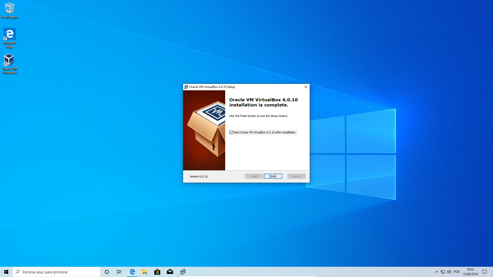
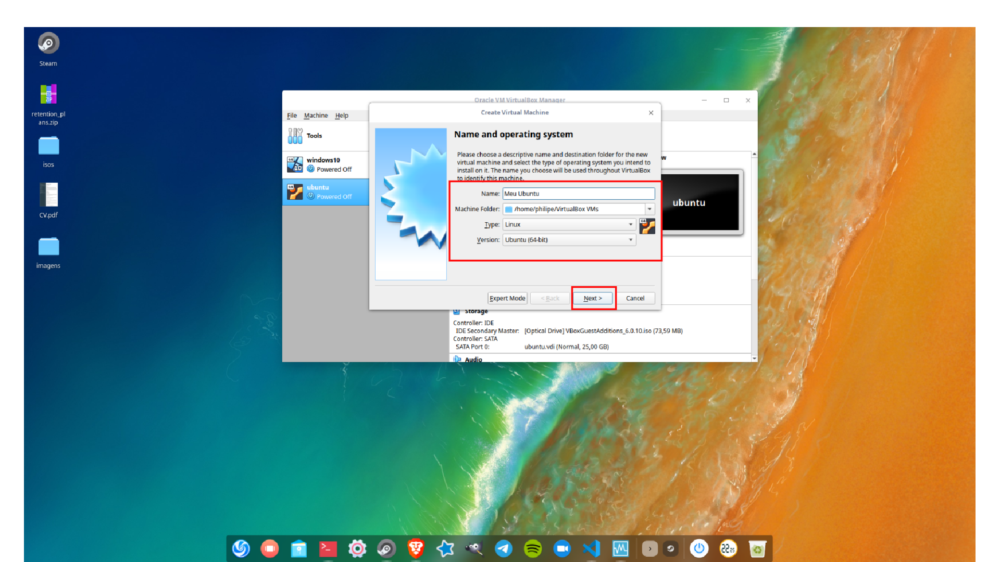
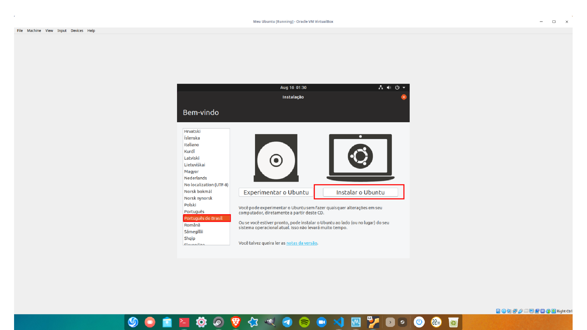
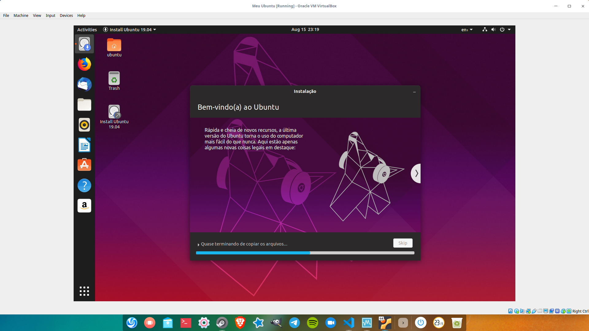

## Introducao a serie sobre linux

Nessa serie de posts irei demonstrar como instalar o Linux, como utilizar a linha de comando, como e onde buscar por informacoes em caso de duvida ou problemas e muito mais. O intuito disso tudo e desmistificar essa aura de dificuldade que o Linux apresenta para muitas pessoas e demonstrar como esse sistema pode ser facil de utilizar e incrivelmente poderoso.

## Instalando o Ubuntu no Virtualbox

Para comecar a nossa jornada o primeiro passo e fazer a instalacao do sistema, existem varias maneiras de se instalar o Linux como por exemplo: instalar como unico sistema operacional da sua maquina, instalar em dual boot com windows(ou outro sistema) e instalar o Linux em uma maquina virtual.

No nosso caso iremos instalar o sistema em uma maquina virtual, a principal vantagem desse metodo para nos consiste em podermos instalar o sistema sem o risco de comprometer a instalacao do sistema operacional que ja esta instalado na nossa maquina, alem de que podemos fazer absolutamente tudo no sistema que estara rodando na maquina virtual inclusive quebrar o sistema e tornalo inutilizavel o que e otimo para quem esta aprendendo.

### Entendendo o VirtualBox

O VirtualBox e um software de virtualizacao(hypervisor) completamente gratuito e que roda em cima de um sistema operacional existente, a sua funcao e simular uma maquina real de maneira que um sistema operacional convidado 'acredita' que esta rodando em uma maquina fisica so sua.

Ao utilizarmos o VirtualBox para criar uma maquina virtual na qual iremos instalar o Linux iremos criar um ambiente completamente isolado da nossa maquina fisica o que como dito anteriormente nos dara um alto grau de liberdade para fazermos todo tipo de experimentacao sem comprometer a nossa maquina fisica.

Existem outros tipos de virtualizacao e de virtualizadores mas como esse nao e o topico principal dos nossos estudos resolvi disponibilizar alguns links que explicam mais sobre o assunto [aqui](https://www.redhat.com/pt-br/topics/virtualization/what-is-virtualization) e [aqui](https://pt.wikipedia.org/wiki/Hipervisor).

### Instalacao do VirtualBox

Irei demonstrar a seguir a instalacao do VirtualBox no Windows 10 e no Ubuntu, nao irei demonstrar a instalacao do mesmo no Mac OSX pois nao tenho acesso facil atualmente a nenhum Mac, porem coloquei logo abaixo um link para um tutorial que ensina a fazer o procedimento no Mac OSX.

- [Windows](#Windows)

- [Ubuntu](#Ubuntu)

- [Mac OSX](https://matthewpalmer.net/blog/2017/12/10/install-virtualbox-mac-high-sierra/index.html)

#### Windows

Primeiramente acesse o esse [link](https://download.virtualbox.org/virtualbox/6.0.10/VirtualBox-6.0.10-132072-Win.exe) e baixe o executavel do VirtualBox, aguarde a conclusao do download e em seguida inicie o instalador.

A partir desse momento va clicando em next ate a seguinte tela aparecer

Nao se assuste clique em Yes e siga em frente, ao fim uma tela ira aparecer solicitando que voce finalize o processo e inicie a aplicacao

#### Ubuntu

Acesse a Ubuntu Software Manager e no menu de busca procure por **virtualbox** 

Clique em **VirtualBox** e em seguida clique no botao **install** e coloque sua senha como na imagem abaixo

Apos isto basta clicar em **launch** e pronto!

### Criando uma maquina virtual e instalando o Ubuntu passo a passo

1 - Abra o VirtualBox e clique no botao **New** como na imagem abaixo

2 - De um nome a sua vm se voce colocar a palavra ubuntu no nome o **VirtualBox** ja preenche os campos **Type** e **Version** automaticamente para voce na duvida deixe tudo como na imagem abaixo e clique em **Next**

3 - Agora e a hora de ajustar a quantidade de memoria RAM da sua maquina virtual, tendo em mente que estamos querendo instalar o **Ubuntu** e que o nosso uso desse sistema nao sera muito pesado qualquer valor a partir de **2 GB** sera suficiente, e atente para a marcacao verde e vermelha apresentada na tela qualquer quantidade de memoria acima da marcacao verde ira ocasionar problemas de performance, no meu caso eu coloquei **8 GB** porque eu posso :)

4 - Na tela para escolher o tipo de arquivo que ira funcionar como o disco rigido da sua maquina marque a opcao **VDI** e clique em **Next**

5 - Agora voce deve escolher como o novo disco virtual deve se comportar isso e ele ira ter um tamanho fixo ou ele ira crescendo conforme for sendo utilizado, no nosso caso devemos selecionar **Dynamically allocated** para como o proprio nome ja diz fazer com que o disco va crescendo conforme utilizamos ele e em seguida clicamos em **Next**

6 - Na proxima tela selecione a quantidade de espaco em disco que voce deseja, algo abaixo dos **10 GB** nao seria adequado, no nosso caso iremos colocar **30 GB** e em seguida clicar em **Create**

7 - Perfeito agora temos a nossa maquina virtual criada e e hora de instalarmos o Ubuntu! clique nesse [link](http://ubuntu.mirror.pop-sc.rnp.br/mirror/ubuntu-releases/19.04/ubuntu-19.04-desktop-amd64.iso) e baixe o Ubuntu 19.04, em seguida selecione va no **VirtualBox** e selecione a maquina virtual que voce acabou de criar e clique em **Settings**

8 - No menu **Settings** clique em **System** e desmarque a opcao **Floppy** pois nao queremos fazer o boot da nossa maquina pelo disquete em hipoteze alguma.

9 - Em seguida clique em **Storage** no menu lateral e selecione o drive de CD-ROM vazio(Empty) como na imagem abaixo apos isto clique no icone de cd que ira aparecer a direita e selecione **Choose Virtual Optical Disk File...**.

10 - Selecione o arquivo **.iso** do Ubuntu que baixamos a alguns passos atras e clique em **open**.

11 - Clique em **ok** e feche o menu de **Settings**, de volta ao menu principal do VirtualBox selecione a sua maquina virtual e clique no botao **Start**.

12 - Uma nova tela ira abrir e o processo de instalacao do Ubuntu ira iniciar, na tela inicial do instalador selecione o idioma e clique em **Instalar o Ubuntu**

13 - Em seguida o instalador ira solicitar que voce selecione o layout do teclado no meu caso selecionei ingles internacional pois esse e o layout do meu teclado, se o seu teclado for portugues ABNT-2 entao selecione esse layout e em seguida clique em **continue**

14 - Agora selecione a **instalacao normal** e marque as caixas para baixar as atualizacoes e instalar softwares de terceiros, isso fara com que a instalacao demore um pouco mais mas ja vai instalar alguns softwares necessarios para o bom funcionamento do sistema o que vai nos poupar tempo no futuro.

15 - Na hora de selecionar o tipo de instalacao selecione **Apagar disco e reinstalar o Ubuntu** e clique em **Instalar agora**. !!Atencao se voce esta instalando o sistema em uma maquina fisica tome cuidado para nao apagar o sistema que ja existe na sua maquina!!.

16 - Ao fazer isso um alerta ira aparecer e voce devera clicar em **continuar**.

17 - Na tela seguinte clique na regiao do mapa onde voce esta, para configurar o fuso horario, em muitos casos o Ubuntu consegue detectar a sua localizacao automaticamente, feito isso clique em **continuar**.

18 - Chegou a hora de criar seu usuario e atribuir uma senha a ele, lembre-se de usar uma senha facil de ser lembrada ou de anotar a senha em algum lugar pois ela sera absolutamente necessaria, apos preencher tudo clique em **continuar**.

19 - Agora o sistema ira comecar a instalar de fato e tudo o que voce tem de fazer e agaurdar, aproveite para tomar aquela chicara de cafe ;).

20 - Quando a instalaco terminar uma menssagem ira aparecer informando que a instalacao foi concluida e solicitando que voce reinicie o computador, basta clicar em **Reiniciar agora**

21 - apos alguns instantes outra tela ira aparecer solicitando que voce remova o disco do leitor de cd, o que significa que voce tem de 'remover' o arquivo iso do leitor de cd virtual em **Settings** -> **Storage** porem o **VirtualBox** ja faz isso para voce entao tudo o que voce precisa fazer e apertar 'Enter'.

### Pos instalacao

Ufa se voce segiu todos os passos ate aqui ja deve ter uma instancia do Ubuntu rodando em sua maquina virtual, mas para ter uma experiencia satisfatoria com a sua maquina virtual e importante realizar alguns passos a mais.

